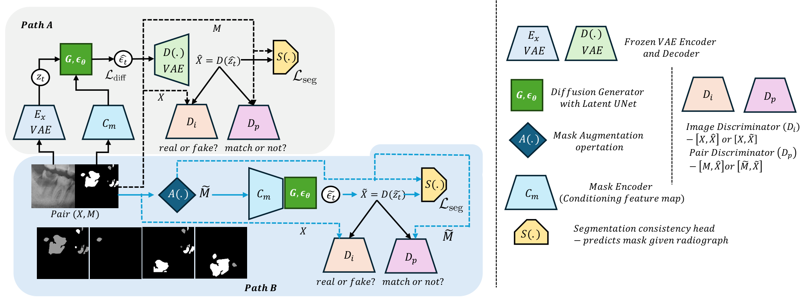
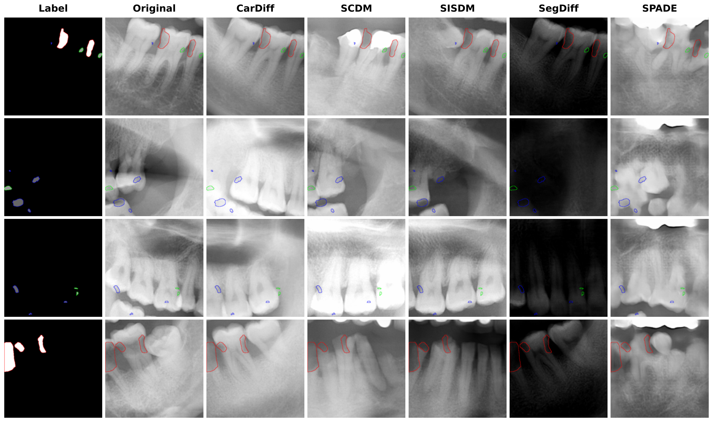
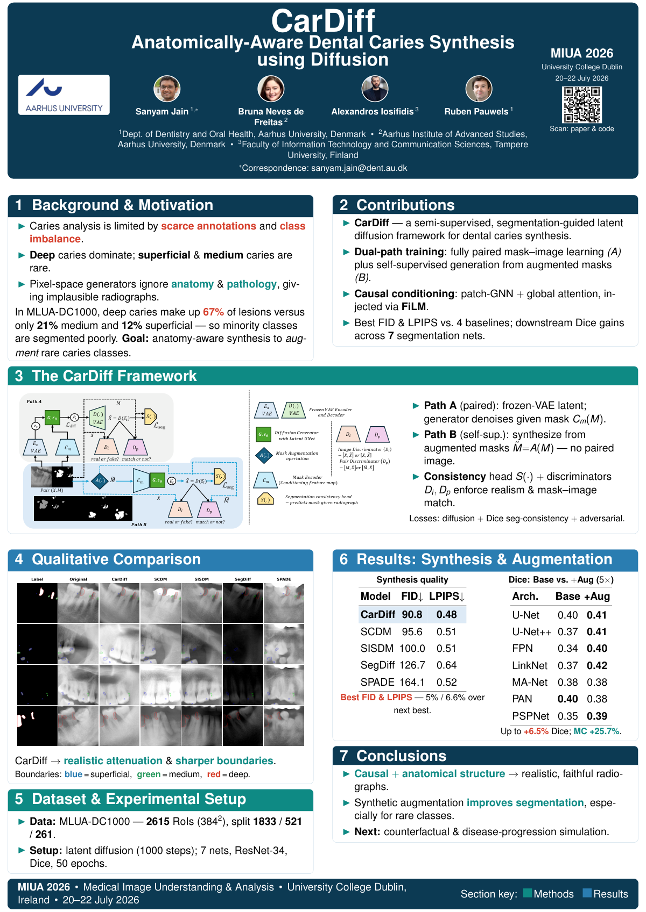
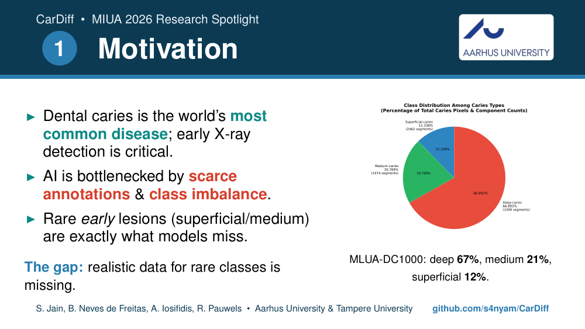
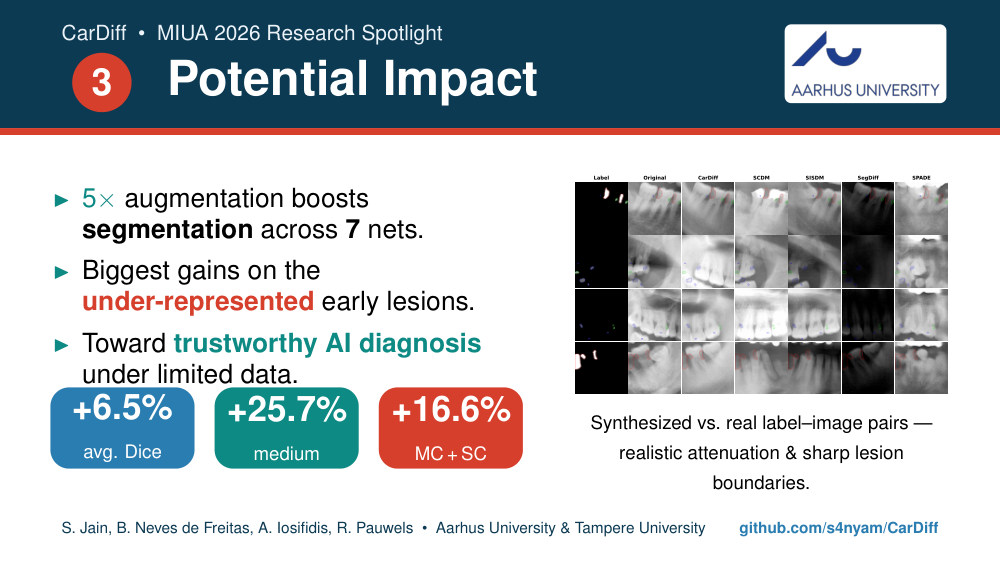

<div align="center">

# CarDiff

### Anatomically‑Aware Dental Caries Synthesis using Diffusion

Causally‑structured, semi‑supervised latent diffusion that synthesizes realistic
intra‑oral radiographs from caries masks — and uses them to augment scarce, class‑imbalanced
segmentation data.

[](https://www.ucd.ie/medicine/miua2026/)
[](assets/CarDiff_MIUA2026_paper.pdf)
[](assets/CarDiff_MIUA2026_poster.pdf)
[](https://www.python.org/)
[](https://pytorch.org/)
[](LICENSE)

<p align="center">
  
</p>

<em>Sanyam Jain<sup>1</sup> · Bruna Neves de Freitas<sup>2</sup> · Alexandros Iosifidis<sup>3</sup> · Ruben Pauwels<sup>1</sup></em><br>
<sub><sup>1</sup> Aarhus University, Denmark · <sup>2</sup> Aarhus Institute of Advanced Studies (AIAS), Aarhus University · <sup>3</sup> Tampere University, Finland</sub>

<sub>To appear at <b>MIUA 2026</b> — 30th Conference on Medical Image Understanding and Analysis, University College Dublin, Ireland · 20–22 July 2026</sub>

</div>

---

## Overview

Dental caries is the most prevalent disease worldwide, and early detection on radiographs is
clinically critical. Yet deep‑learning caries segmentation is bottlenecked by **scarce pixel‑level
annotations** and **severe class imbalance** — early *superficial* and *medium* lesions, the ones we
most want to catch, are heavily under‑represented.

**CarDiff** addresses this by learning to *generate* anatomically faithful radiographs conditioned
on lesion masks, then using the synthetic images as targeted data augmentation. It combines:

- **Dual‑path semi‑supervised training** — a paired path (real mask–image pairs) and a
  self‑supervised path driven by *augmented* masks with no paired image.
- **Causally‑aware, anatomy‑aware conditioning** — a patch‑graph neural network for local
  cause‑effect structure (e.g. *enamel mineral loss → reduced radiodensity*) plus global
  self‑attention for long‑range anatomical context, injected into a denoising U‑Net via **FiLM**.
- **Anatomical‑consistency & pathological‑plausibility regularizers** and **dual discriminators**
  (image realism `D_i`, mask–image correspondence `D_p`), with a **segmentation‑consistency head**
  that enforces the synthesized image to reproduce its conditioning mask.

All diffusion happens in the latent space of a **frozen dental VAE**.

> **TL;DR** — CarDiff achieves the **best FID (90.76)** and **LPIPS (0.480)** among four strong
> baselines, and 5× synthetic augmentation improves downstream caries segmentation by **+6.5% mean
> Dice** across seven architectures — with the largest gains on the rare early lesions.

---

## Key results

### Synthesis quality (test set)

| Model | FID ↓ | KID ↓ | IS ↑ | LPIPS ↓ |
|:--|:--:|:--:|:--:|:--:|
| **CarDiff (ours)** | **90.76** | 0.021 | 2.65 ± 0.27 | **0.480** |
| SCDM | 95.55 | **0.016** | **2.75 ± 0.28** | 0.514 |
| SISDM | 99.96 | 0.024 | 2.40 ± 0.18 | 0.513 |
| SegDiff | 126.72 | 0.071 | 2.21 ± 0.18 | 0.636 |
| SPADE | 164.05 | 0.091 | 2.18 ± 0.23 | 0.517 |

Best FID and LPIPS overall — a **5%** and **6.6%** improvement over the next‑best method (SCDM),
with competitive KID and IS.

### Downstream augmentation (5× training data)

Averaged over **seven** segmentation architectures (U‑Net, U‑Net++, FPN, LinkNet, MA‑Net, PAN, PSPNet):

| Metric | Gain |
|:--|:--:|
| Mean Dice (all classes) | **+6.5%** |
| Medium caries (MC) | **+25.7%** |
| MC + SC (early lesions) | **+16.6%** |
| Superficial caries (SC) | +1.6% |

<p align="center">
  
</p>
<p align="center"><sub>Synthesized ROIs vs. real label–image pairs. Boundary colors: <b>blue</b> = superficial, <b>green</b> = medium, <b>red</b> = deep caries.</sub></p>

---

## Poster & Research Spotlight

Presentation materials prepared for **MIUA 2026** (University College Dublin · 20–22 July 2026).

### Conference poster (A0 portrait)

<p align="center">
  <a href="assets/CarDiff_MIUA2026_poster.pdf"></a>
</p>
<p align="center"><sub>📄 <a href="assets/CarDiff_MIUA2026_poster.pdf">Poster (PDF)</a> &nbsp;·&nbsp; 

### 1-minute Research Spotlight

Backdrop slides for the ≤ 60-second spotlight video — **Motivation → Technical Innovation → Potential Impact**.

<p align="center">
  
  <br><br>
  
  <br><br>
  
</p>
<p align="center"><sub>🖥️ <a href="assets/CarDiff_MIUA2026_spotlight.pdf">Slides (PDF)</a> &nbsp;·&nbsp;

---

## Repository structure

```
CarDiff/
├── synthesis/            # CarDiff diffusion model — training, inference & synthesis metrics
│   ├── cardiff/          #   the model package (VAE, FiLM-UNet, causal module, losses, trainer, pipeline)
│   ├── main.py           #   entry point: train / eval_many
│   ├── training.py       #   training loop      · eval.py  sampling/eval
│   ├── infer_multi.py    #   multi-checkpoint inference
│   ├── fill_mask*.py     #   mask-conditioned generation
│   ├── fid.py kid.py IS.py clpips.py   # synthesis-quality metrics (+ *_classwise)
│   └── process_dc.py split_data.py     # data preparation
├── segmentation/         # Downstream augmentation study (7 architectures) + result CSVs
│   ├── train_seg.py      #   baseline training
│   ├── train_seg_aug.py  #   training with synthetic augmentation
│   ├── augment_masks.py  #   mask augmentation for synthesis
│   └── 4.results_aug/    #   per-model / per-class Dice & IoU results
├── baselines/            # Comparison methods: SPADE · SCDM · SISDM · SegDiff
├── analysis/             # Plotting & qualitative mosaics
├── tools/                # Data utilities (manual masking app, pixel cleanup)
├── assets/               # Paper, poster & 1-min spotlight (PDF + LaTeX sources)
├── docs/                 # Figures & supplementary material
├── requirements.txt
└── LICENSE
```

---

## Installation

Tested with **Python 3.10** and CUDA/ROCm PyTorch.

```bash
git clone https://github.com/s4nyam/CarDiff.git
cd CarDiff
python -m venv .venv && source .venv/bin/activate
pip install -r requirements.txt
```

---

## Usage

> Run the synthesis commands from inside `synthesis/` (the `cardiff` package and scripts live there).

### Train CarDiff

```bash
cd synthesis
# full dual-path (Path A + self-supervised Path B)
python main.py --cardiff --segmentation_guided --enable_path_b --mode train
# Path A only
python main.py --cardiff --segmentation_guided --mode train
# with a pre-trained VAE / resume
python main.py --cardiff --segmentation_guided --enable_path_b --mode train \
               --vae_pretrained_path /path/to/vae.pt --resume_epoch 100
```

### Generate radiographs

```bash
python main.py --cardiff --segmentation_guided --mode eval_many --eval_sample_size 1000
```

### Measure synthesis quality

```bash
python fid.py --real /path/to/real --generated_base /path/to/generated --epochs 100 200 --suffix -ddpm
# kid.py / IS.py / clpips.py follow the same interface; *_classwise.py report per-lesion scores
```

### Downstream segmentation with synthetic augmentation

```bash
cd segmentation
python train_seg_aug.py --model Unet --data_dir train_data \
       --aug_img_dir aug_img --aug_mask_dir aug_seg --aug_multiplier 4 --epochs 50
# --model ∈ {Unet, UnetPlusPlus, FPN, Linknet, MAnet, PAN, PSPNet}
```

Key training flags:

| Flag | Description |
|:--|:--|
| `--cardiff` | Use CarDiff (vs. the SegDiff‑style baseline) |
| `--segmentation_guided` | Condition generation on the caries mask |
| `--enable_path_b` | Enable the self‑supervised augmented‑mask path |
| `--mode` | `train` · `eval_many` |
| `--eval_sample_size` | Number of samples to synthesize in `eval_many` |

---

## Dataset

Experiments use **MLUA‑DC1000**: 600 full‑size panoramic radiographs with caries labels, processed
into **2,615 ROIs** of 384 × 384 (empty‑mask windows discarded), split **1,833 / 521 / 261**
(train / val / test). Lesions are labelled as superficial (SC), medium (MC) and deep (DC) caries.
The dataset is not redistributed here — please refer to the paper for access.

---

## Baselines

`baselines/` contains our training/inference wrappers for the four comparison methods:
**SPADE**, **SCDM**, **SISDM**, and **SegDiff**. Each folder mirrors the `train_multi.py` /
`infer_multi.py` / `run.sh` layout used for CarDiff.

---

## Citation

If you find this work useful, please cite:

```bibtex
@inproceedings{jain2026cardiff,
  title     = {CarDiff: Anatomically-Aware Dental Caries Synthesis using Diffusion},
  author    = {Jain, Sanyam and Neves de Freitas, Bruna and Iosifidis, Alexandros and Pauwels, Ruben},
  booktitle = {Medical Image Understanding and Analysis (MIUA)},
  year      = {2026}
}
```

---

## Acknowledgements

Training was performed on the **LUMI** supercomputer. We thank the MIUA 2026 community.
Built on top of [🤗 diffusers](https://github.com/huggingface/diffusers) and
[segmentation‑models‑pytorch](https://github.com/qubvel/segmentation_models.pytorch).

## License

Released under the [MIT License](LICENSE). The MLUA‑DC1000 data and any clinical material are **not**
covered by this license.
